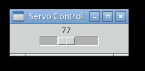

# ROBOTIK KOL v2

## NOT:
> Atılan ses kayıtlarından, su altında bulunması istenen cismin kalem benzeri bir cisim olduğu belirtilmiş yani bir şekle sahip bu bazı durumlarda kameranın objektifini gelecek olan yansımalardan dolayı yanlış çıktı verebilme veya raspberry pi hareketinde yanlış bir harekete sebep olabilir.
> Eğer böyle bir sorun ile karşılaşılırsa yöntem değiştirmek gerekebilir.


__YAZILIM__
- Servo motorlarının çalıştırılmaya çalışılması:
    - bulunan kaynaklar:
        - Yerli Kaynaklar:
            - [Raspberry Pi 3 İle Servo Motor Kontrolü Nasıl Yapılır?](https://maker.robotistan.com/raspberry-pi-dersleri-11-servo-motor-kontrolu/)
            - [Raspberry PI ile Servo Kontrolü](https://www.mekatronikmuhendisligi.com/raspberry-pi-ile-servo-motor-kontrolu.html)
            - [Raspberry PI ile Servo Pan Kontrolü](https://www.projehocam.com/raspberry-pi-ile-servo-pan-kontrolu/)
            - [Raspberry PI ile Servo Motor Kontrolü Nasıl Yapılır?](https://www.robotelektronik.com/blog/icerik/raspberry-pi-ile-servo-motor-kontrolu-nasil-yapilir)


        - Yabancı Kaynaklar:
            - [Servo Motor Control With Raspberry PI](https://www.instructables.com/Servo-Motor-Control-With-Raspberry-Pi/)
            - [1. Raspberry PI Servo Motor Control](https://tutorials-raspberrypi.com/raspberry-pi-servo-motor-control/)
            - [2. Raspberry PI Servo Motor Control](https://www.youtube.com/watch?v=xHDT4CwjUQE)

__KOD__
```py
from Tkinter import *
import Rpi.GPIO
import time

# GPIO pinlerinin ayarlanması
GPIO.setmode(GPIO.BCM)
GPIO.set(18, GPIO.OUT)
pwm = GPIO.PWM(18, 100)
pwm.start(5)
GPIO.setwarnings(False)

class App:
    def __init__(self, master):
        frame = Frame(master)
        frame.pack()
        scale = Scale(Frame, from_=0, to=180,
                        orient=HORIZONTAL, command=self.update)
        scale.grid(row=0)


    def update(self, angle):
        duty = float(angle) / 10.0 + 2.5
        pwm.ChangeDuty(duty)

root = Tk()
root.wm_title("Servo Kontrol")
app = App(root)
root.geometry("200x50+0+0")
root.mainloop()

```
- Yukarıdaki program 18 nolu pine takılmış olan servo motor kontrolünü ekranda çıkan bir 
track bar yardımı ile kontrol etmemize yarıyor. Program yoğunluk olarak harici paketleri kullanılmıştır.


__ELEKTRONIK__ 
<br>
<br>
Raspbery pi ve servo bağlantısı şekildeki gibidir.


çıktı:
<br>
    - programı açtığımızda karşımıza böyle bir ekran çıkmaktadır
    - trackbar öğesini kaydırarak servo motorumuzda eş zamanlı hareket görürüz.

<br>
    <!---->
    